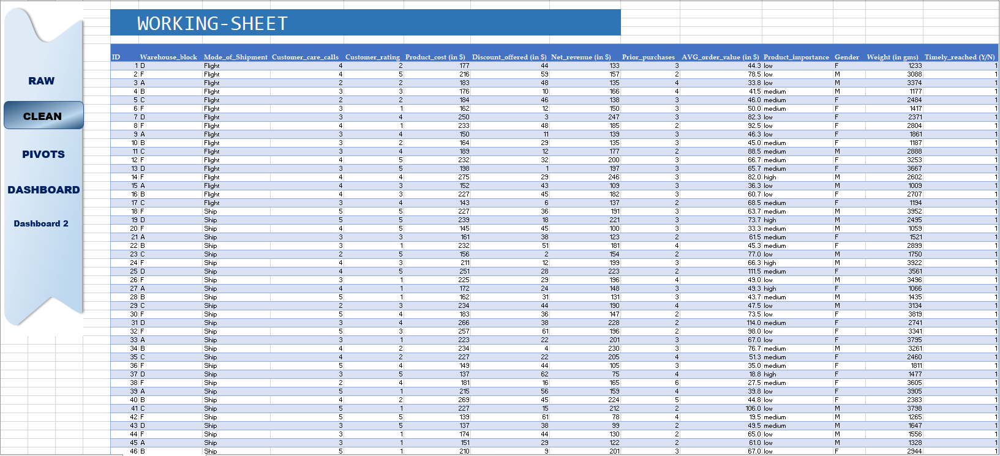
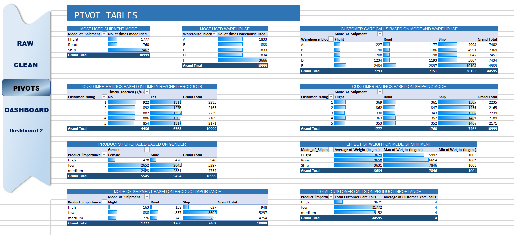
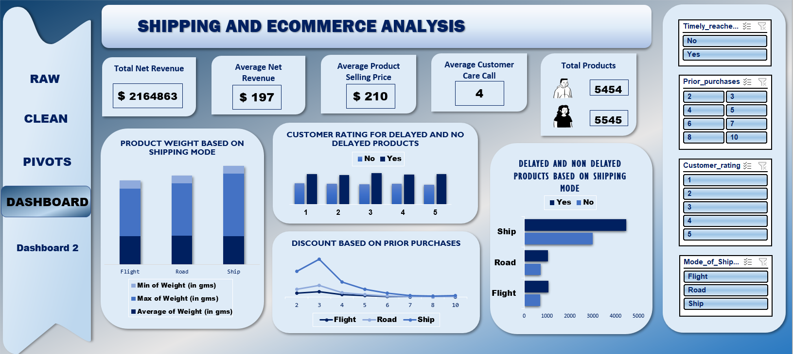
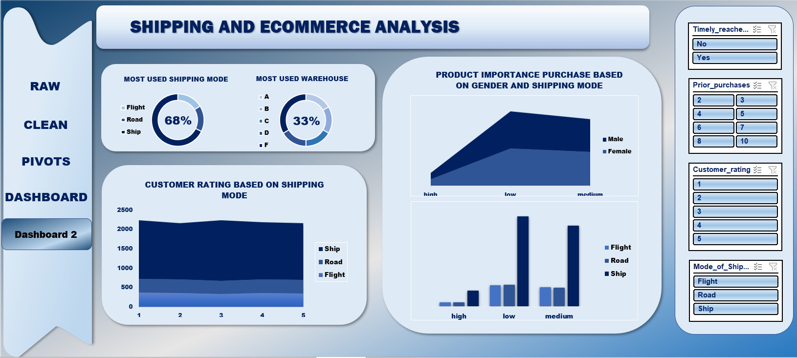

# 📦 E-Commerce Shipping Performance & Customer Satisfaction Analysis

## 🎯 Problem Solved

E-commerce businesses depend heavily on efficient shipping operations to ensure customer satisfaction and maintain profitability. Delayed deliveries, inefficient warehouse utilization, excessive customer support interactions, and poor shipment planning can negatively affect both customer experience and operational performance.

The objective of this project was to analyze shipping operations and customer-related metrics to identify patterns affecting delivery performance, shipment preferences, warehouse utilization, product demand, customer ratings, and customer care interactions. The analysis was conducted using Microsoft Excel to transform raw data into meaningful business insights and actionable recommendations.

---

# 📊 Data Overview

The dataset contains shipping, customer, and product-related information for **10,999 orders**.

### Dataset Features

- Warehouse Block
- Mode of Shipment
- Customer Care Calls
- Customer Rating
- Product Cost
- Discount Offered
- Net Revenue
- Prior Purchases
- Average Order Value
- Product Importance
- Gender
- Product Weight
- Timely Reached Status

### Key Metrics

| Metric | Value |
|----------|----------|
| Total Records | 10,999 |
| Delayed Deliveries | 6,563 |
| On-Time Deliveries | 4,436 |
| Most Used Shipment Mode | Ship |
| Most Utilized Warehouse | Warehouse F |
| Average Product Weight | 3,634 gms |
| Maximum Product Weight | 7,846 gms |
| Minimum Product Weight | 1,001 gms |
| Total Net Revenue | $2,164,863 |

---

# 🧹 Data Cleaning

Before performing analysis, the dataset was cleaned and prepared to ensure accuracy and consistency.

## Cleaning Steps Performed

- Checked for missing and null values.
- Verified data consistency across all columns.
- Removed formatting inconsistencies.
- Standardized column names and data structure.
- Validated numerical fields such as product cost, revenue, discounts, and weight.
- Ensured the dataset was ready for Pivot Table analysis and dashboard creation.

## Clean Dataset Preview

---

# 📈 Analyzing Through Pivot Tables

Pivot Tables were used to answer key business questions and identify patterns in shipment operations, customer behavior, warehouse utilization, and delivery performance.

## Analysis Areas

### Shipment Mode Analysis
- Identified the most frequently used shipment mode.
- Compared shipment volumes across Flight, Road, and Ship modes.

### Warehouse Utilization Analysis
- Evaluated shipment volume handled by each warehouse block.
- Identified the warehouse with the highest operational workload.

### Customer Care Call Analysis
- Analyzed customer care calls across shipment modes and warehouses.
- Identified areas generating the highest customer support demand.

### Customer Ratings Analysis
- Compared ratings between delayed and on-time deliveries.
- Examined the relationship between customer satisfaction and delivery performance.

### Product Importance Analysis
- Evaluated customer purchasing behavior across product importance categories.
- Determined which product category contributed the highest purchase volume.

### Product Weight Analysis
- Compared average, minimum, and maximum product weight by shipment mode.
- Studied the impact of product weight on shipping preferences.

### Discount and Prior Purchase Analysis
- Analyzed the relationship between discounts and customer purchasing behavior.
- Examined how prior purchases influence discount patterns.

## Pivot Table Preview

---

# 📊 Visualization (Interactive Dashboard)

Two interactive dashboards were developed in Microsoft Excel to transform analytical findings into a business reporting solution.

The dashboards provide a comprehensive view of shipping performance, customer behavior, product characteristics, warehouse utilization, and delivery outcomes.

## Dashboard 1: Shipping & E-Commerce Analysis

This dashboard focuses on operational performance and customer-related metrics.

### Key Components

#### KPI Cards
- Total Net Revenue
- Average Net Revenue
- Average Product Selling Price
- Average Customer Care Calls
- Total Products Purchased

#### Product Weight Analysis
Visualizes minimum, maximum, and average product weight handled by each shipment mode.

#### Customer Rating Analysis
Compares customer ratings between delayed and non-delayed deliveries.

#### Delivery Performance Analysis
Shows the distribution of delayed and non-delayed products across different shipment modes.

#### Discount Trend Analysis
Illustrates the relationship between discounts and prior purchases.

#### Interactive Filters
Users can dynamically filter the dashboard using:
- Delivery Status
- Prior Purchases
- Customer Rating
- Shipment Mode

### Business Value

This dashboard helps stakeholders monitor shipment performance, customer satisfaction, product characteristics, and revenue-related metrics through a single interactive view.

---

## Dashboard 2: Operational Performance Dashboard

The second dashboard focuses on shipment distribution, warehouse performance, customer care interactions, and product importance analysis.

### Key Components

#### Shipment Mode Distribution
Provides a breakdown of shipment volumes across all shipping modes.

#### Warehouse Utilization Analysis
Displays warehouse-wise shipment handling performance.

#### Customer Care Call Analysis
Highlights customer support interactions across warehouses and shipment methods.

#### Product Importance Analysis
Shows purchasing trends across high, medium, and low-importance products.

#### Delivery Performance Metrics
Provides additional operational insights regarding shipment status and customer behavior.

### Business Value

This dashboard enables management to identify high-volume shipping channels, warehouse workload distribution, customer service demand, and product purchasing patterns.

## Dashboard Preview

### Dashboard 1

### Dashboard 2

---

# 🔍 Insights

### 1. Shipment Mode Analysis
- Ship mode is the most frequently used shipment method with **7,462 shipments**, significantly higher than Road and Flight.
- The high usage of Ship mode suggests that it is the preferred option for large-scale and long-distance deliveries.

### 2. Warehouse Utilization
- Warehouse **F** handled the highest number of shipments among all warehouse blocks.
- This indicates that Warehouse F plays a major role in the company's distribution network and fulfillment operations.

### 3. Customer Care Calls Analysis
- The highest number of customer care calls were associated with products shipped through **Ship mode**.
- Since Ship mode handles the majority of orders, it naturally generates a larger volume of customer inquiries and support requests.

### 4. Customer Ratings and Delivery Status
- Customer ratings for delayed and non-delayed products show only a small difference.
- This suggests that delivery delay alone is not the only factor influencing customer satisfaction, and other service-related factors may also affect customer ratings.

### 5. Product Importance Analysis
- **Low-importance products recorded the highest number of purchases (5,297 orders).**
- Medium-importance products followed with 4,754 purchases, while high-importance products accounted for the lowest purchase volume.
- This indicates that customers frequently purchase lower-priority products, making them an important contributor to overall sales volume.

### 6. Product Weight and Shipment Mode
- Ship mode handled the heaviest products, with a maximum product weight of **7,846 grams**.
- This shows that Ship mode is preferred for transporting larger and heavier products.

### 7. Discount and Prior Purchases
- Discounts appear to influence customer purchases initially; however, discounts seen to be declining after 3 prior purchases.
- This suggests business focuses more on attracting new customers rather than returning.

### 8. Delivery Delays and Customer Support
- Delayed shipments are associated with a higher number of customer service interactions.
- Customers are more likely to contact support when delivery expectations are not met.

---

# ✅ Conclusion

The analysis reveals that Ship mode serves as the backbone of the company's shipping operations, handling the majority of deliveries and transporting heavier products. Warehouse F emerged as the most utilized warehouse, indicating its critical role in the fulfillment process.

Customer purchasing behavior shows a strong preference for low-importance products, making them a significant contributor to total sales volume. While delivery delays are present, customer ratings do not vary drastically between delayed and non-delayed shipments, suggesting that overall customer satisfaction is influenced by multiple factors beyond delivery speed.

Overall, the dashboards successfully provide a centralized view of logistics performance, customer behavior, warehouse activity, and shipment trends, enabling stakeholders to make more informed and data-driven decisions.

---

# 💡 Recommendations

## Improve Shipping Quality
- Enhance packaging standards to reduce the risk of product damage during transportation.
- Use stronger and more secure storage methods while products are in transit.

## Reduce Delivery Delays
- Improve route planning and logistics coordination to minimize shipping delays.
- Continuously monitor delivery performance to identify bottlenecks in the shipping process.

## Strengthen Customer Service
- Resolve customer issues as early as possible, preferably during the first customer interaction.
- Improve communication regarding shipment status to reduce unnecessary support calls.

## Optimize Warehouse Operations
- Analyze the practices of Warehouse F and implement successful strategies across other warehouses where applicable.
- Ensure that warehouse resources are balanced to prevent over-dependence on a single warehouse.

## Refine Discount Strategies
- Avoid offering excessive discounts that do not generate significant additional purchases.
- Focus on targeted promotional campaigns that maximize customer engagement while maintaining profitability.

## Monitor Key Performance Metrics
- Continue using dashboards to track shipment performance, customer satisfaction, customer care calls, and warehouse utilization.
- Regular monitoring will support faster decision-making and continuous operational improvement.

---

# 🛠️ Tools Used

## Microsoft Excel

- Data Cleaning
- Data Preparation
- Pivot Table Analysis
- KPI Development
- Interactive Dashboard Creation
- Data Visualization
---
